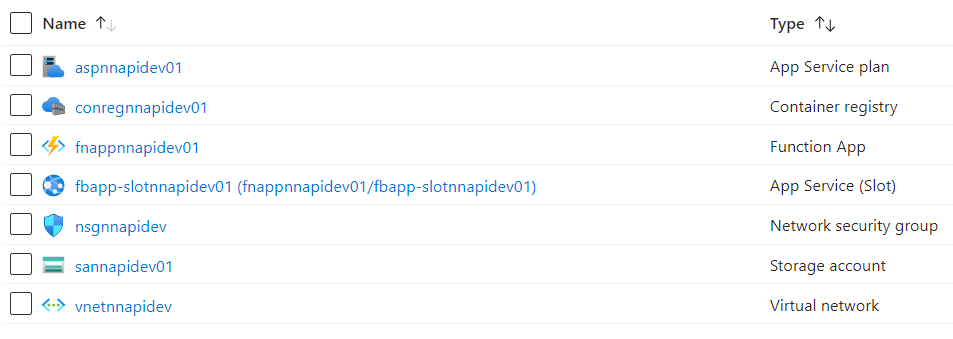

# Introduction 
This project is used to run an API using Azure Function app. It has two pipelines 'azure-pipeline.yaml' and 'deploy-code-pipeline.yaml'. The former pipeline deploys the infrastructure in Azure in a given subscription and the later pipeline deploys the code.

# Important
- Replace the empty variables with the respective values before running the Infra deployment pipeline.
- Ensure that a new Service connection is created for the Docker Registry after the Infrastructure is deployed. Without this service connection the code cannot be deployed.
- Ensure to have a same dockerImage name in the dev.tfvars (line no#20) and eploy-code-pipeline.yaml (line no#10)

# Requirement
- Azure Subscription
- A storage account with a container for state file maintenance

# Getting Started
** Installation process **
Knowledge on creating Azure Devops pipelines https://learn.microsoft.com/en-us/azure/devops/pipelines/create-first-pipeline?view=azure-devops&tabs=python%2Ctfs-2018-2%2Cbrowser
For easy code management it is advisable to use any IDE like IntelliJ or VSCode. 
Install git if not done yet. https://learn.microsoft.com/en-us/windows/wsl/tutorials/wsl-git
Install terraform and configure to run it via your IDE or your CLI. https://developer.hashicorp.com/terraform/tutorials/aws-get-started/install-cli
Install postman to test the API response (optional).
Install Azure CLI. https://learn.microsoft.com/en-us/cli/azure/install-azure-cli

# Build and Test
- Navigate to the folder where this project is placed from your IDE. 
- Create a new branch called 'dev'
- From the IDE terminal or any CLI, issue 'terraform init' command and then validate the terraform code with 'terraform validate'.
- To create a local state file issue 'terraform plan'. Note this will sometimes ask you to authenticate you to your Azure subscription.
- After successful validation, commit and push your changes.
- Navigate to Azure Git and Use 'azure-pipeline.yaml' file for creating the infra deployment pipeline.
- Run the infra pipeline to deploy the infrastructure.
- To change the variable values refer dev.tfvars file and change it accordingly. If a new env stage is created, please create a new .tfvars file.
- Verify the deployed resource by logging into the Azure portal and navigate to the resource group created by the pipeline. See the image below.
- To allow the source code that contains docker image into the Azure container registry, the pipeline should have access to container registry. 
- Create a new service connection for Docker registry. See this https://learn.microsoft.com/en-us/azure/devops/pipelines/ecosystems/containers/acr-template?view=azure-devops
- Update the variable 'dockerSerCon' in yaml file deploy-code-pipeline.yaml with the above created service connection.
- Ensure the source code by running the docker image locally to see if that works.
- Commit changes if any for the 'source' code, push and run the code pipeline.
- Navigate to Azure Git and Use 'deploy-code-pipeline.yaml' file for creating the code deployment pipeline.
- Run the code deployment pipeline and this will publish the docker image to the Container Registry.
- Login to Azure portal and open the Azure Container registry and navigate to the Repositories to verify the recently pushed docker image.

# Contribute
There are a lot of improvements needed to make this project and the related deployments fault proof.
- Improve the infra code to handle the terraform statefile at a backend storage in cloud.
- Improve infra code to provide authorization to the backend storage account for the newly created resource group
- Have separate project for Infrastructure and Code for seamless DevOps maintenance.
- Improve the code pipeline to create artifacts for the source code.
- Improve variable substitution from Pipeline Runtime variables or using variable groups.

# Images 
